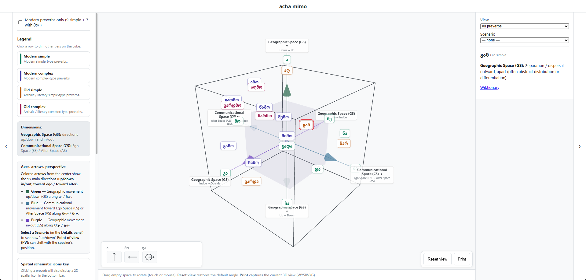

# acha mimo

**acha mimo** is an interactive 3D diagram of Georgian preverbs in conceptual space (after Rusudan Asatiani), with WYSIWYG print, verb-specific highlights, and JSON-driven data.



## What this site shows

The diagram is an interactive **3D wireframe cube** (2×2×2 in world units) inspired by Rusudan Asatiani’s model. Georgian **preverbs** (lemma labels) sit at positions from [`layout.json`](public/data/layout.json); styling and inventory metadata come from [`preverbs.json`](public/data/preverbs.json).

**Two conceptual “dimensions”** (see axis captions on the cube and the Reference sidebar):

- **Geographic Space (GS)** — physical orientation: **up / down** (ა- / ჩა-, green **Y** axis) and **out of / into** an enclosure (გა- / შე-, purple **Z** axis). The scene includes a faint inner box so in/out reads clearly; some lemmas (e.g. **და-**, **წა-**, **გადა-**) get extra 3D cues in code.
- **Communicational Space (CS)** — participant perspective: **toward Alter** vs **toward Ego** along **მი- / მო-** (blue **X** axis). Point of view is not a third spatial axis; it is explained in copy and **scenarios**.

**Center arrows** — Six shafts from the origin point toward the simple poles; when you **select** a preverb, arrows listed in that entry’s `highlightArrows` brighten (see [`preverb-arrows.ts`](src/diagram/preverb-arrows.ts) / `layout.json`).

**Scenarios** — Short **Point of view** and **CS** teaching snippets defined in [`scenarios.ts`](src/diagram/scenarios.ts). Choosing one in **Details** adds a note in the panel and **highlights** the listed preverb ids on the labels (without changing layout positions).

**Tiers** — Legend in Reference maps four morphological tiers (modern simple/complex, old simple/complex) to label colors; clicking a tier **dims** other tiers on the cube.

**Verb-specific mode** — **Details → View** can switch to a verb profile from [`diagram_verbs.json`](public/data/diagram_verbs.json): only lemmas in `usedPreverbIds` stay fully visible; per-lemma **annotations** (note, citation, examples) appear when selected.

## Source

**Citation:** Rusudan Asatiani, _Dynamic Conceptual Model of the Linguistic Structuring of Space: the Georgian Preverbs_ (Institute of Oriental Studies, Georgia), 2007 [[source](https://archive.illc.uva.nl/Tbilisi/Tbilisi2007/abstracts/3.pdf)].

## Develop

```bash
npm install
npm run dev
```

Open the URL Vite prints (usually `http://localhost:5173`).

- **Embed / iframe test:** with the dev server running, open [`/embed-test.html`](http://localhost:5173/embed-test.html) — iframes load the app with `?embedded=1` (paths are relative so they work on GitHub Pages project URLs too).
- **Lint:** `npm run lint` (ESLint + TypeScript).
- **Format:** `npm run format` (Prettier); CI-style check: `npm run format:check`.

## Build

- **Demo site** (includes `data/*.json` under `dist/data/`): `npm run build` → output in `dist/`.
- **Embeddable library** (ESM + IIFE + CSS): `npm run build:lib` → output in `dist-lib/` (`acha-mimo.js`, `acha-mimo.iife.js`, `acha-mimo.css`).

Run both with `npm run build:all`.

### Deploy (GitHub Pages)

In the mono-repo setup, deployment is handled by the parent `verb-website` pipeline.

- Build from `websites/verb-website/` with:
  - `python tools/build_pipeline.py --stage output-generation --production`
- That pipeline runs `preverb-cube` builds and syncs outputs into:
  - `dist/preverb-cube/` (standalone app)
  - `dist/preverb-cube-lib/` (embeddable library)

If you develop `preverb-cube` in isolation, `npm run build:all` still works locally for validating this component, but production publishing should come from the parent pipeline.

---

## Data files (overview)

| File                                                             | JSON shape                                        | Role                                                                                                                                                                                                                   |
| ---------------------------------------------------------------- | ------------------------------------------------- | ---------------------------------------------------------------------------------------------------------------------------------------------------------------------------------------------------------------------- |
| [public/data/preverbs.json](public/data/preverbs.json)           | `{ "preverbs": PreverbEntry[] }`                  | Inventory: `id`, Georgian `display`, `tier`, `simpleId`, `modernPreverb`, optional `spatialIconRowIds`, `axisHints` (`geographic` / `communicational` / `distance`), `specialRules`, `aliases`, `wiktionaryPath`, etc. |
| [public/data/layout.json](public/data/layout.json)               | `{ "entries": LayoutEntry[] }`                    | 3D placement: `id`, `anchor`, `position`, optional `labelOffset`, optional `highlightArrows`, optional `axisHints` (merged into the detail panel with `preverbs.json`).                                                |
| [public/data/diagram_verbs.json](public/data/diagram_verbs.json) | `{ "verbs": Record<string, VerbDiagramProfile> }` | Verb mode: each key is a `verbKey`; profile has optional `label`, `usedPreverbIds`, and optional `annotations` map (`note`, `citation`, `examples`).                                                                   |

Types match [`src/diagram/types.ts`](src/diagram/types.ts).

---

## Configuration details

### Coordinate system (3D)

The wireframe is a **2×2×2** cube centered at the origin. Preverb **labels** and **pick targets** use the entry’s `position` plus optional `labelOffset`. **Right-handed** world axes:

| Axis  | Positive direction | Negative direction | Role                                                   |
| ----- | ------------------ | ------------------ | ------------------------------------------------------ |
| **X** | +X                 | −X                 | **მი-** (Alter / away) vs **მო-** (Ego / hither)       |
| **Y** | +Y                 | −Y                 | **ა-** (up) vs **ჩა-** (down) — geographic vertical    |
| **Z** | +Z                 | −Z                 | **გა-** (out of enclosure) vs **შე-** (into enclosure) |

Axis **lines** and **captions** match this mapping (see [`axis-labels.ts`](src/diagram/axis-labels.ts)).

### `layout.json`

- **`entries`**: one object per preverb that appears on the cube. **`id`** must match an entry in `preverbs.json` or it is ignored.

**Print** uses the live camera; reset with **Reset view** for the default angle.

Per entry:

| Field             | Required | Description                                                                                                          |
| ----------------- | -------- | -------------------------------------------------------------------------------------------------------------------- |
| `id`              | yes      | Preverb id (e.g. `ga`, `she`, `gadmo`, `tsa`, `agh`, `aghmo`).                                                       |
| `anchor`          | yes      | `vertex` \| `edge` \| `face` \| `cluster` — documentary; does not change math in code.                               |
| `position`        | yes      | `[x, y, z]` — base point in world space.                                                                             |
| `labelOffset`     | no       | `[dx, dy, dz]` added to `position` for the **visible label** and pick sphere (keeps click target aligned with text). |
| `highlightArrows` | yes\*    | Which **center** arrows brighten when this preverb is selected — **only** source of truth (see below).               |
| `axisHints`       | no       | Extra sidebar copy; **merged** with `preverbs.json` hints (layout wins on overlap).                                  |

**`highlightArrows`:** array of **direction ids** — the simple preverb pole each center shaft points toward: `a` (up / ა- / +Y), `cha` (down / ჩა- / -Y), `mi` (towards alter space / მი- / +X), `mo` (towards ego space / მო- / -X), `she` (inward / შე-, −Z), `ga` (outward / გა-, +Z). 

Use **`[]`** when this lemma should not highlight any center arrows (e.g. გადა- uses the separate enclosure arrows in the scene). Omitting the field means **no** highlights for that id. Invalid strings are dropped; if none remain, behavior matches `[]`.

\*Every preverb that appears on the cube should include this field in your `layout.json`.

### `preverbs.json`

Each preverb object includes at least: `id`, `display`, `tier`, `simpleId`, `modernPreverb`, and optionally `spatialIconRowIds`, `axisHints`, `specialRules`, `aliases`, `wiktionaryPath`, etc.

**`tier`:** `modern_simple` \| `modern_complex` \| `old_simple` \| `old_complex`.

**`simpleId`:** for `modern_complex` lemmas, the base simple preverb id (e.g. `she` for შემო-); otherwise `null`.

**`modernPreverb`:** when true, the lemma is part of the diagram’s “modern preverbs” (9 simple preverbs + 6 complex preverbs with მო-); the **Modern preverbs only** checkbox (Reference panel) filters on this flag.

**`spatialIconRowIds`:** which schematic icon rows appear in the **canvas** (bottom-left chrome) and in the Reference **spatial icons key** — **only** source of truth. Pole ids must be listed in `SPATIAL_ICON_ROW_IDS` in [`src/diagram/spatial-icons.ts`](src/diagram/spatial-icons.ts). Use **`[]`** for no icons (e.g. გარდა-).

The **detail panel** merges `axisHints` from **both** `preverbs.json` and `layout.json` for the same `id`.

### `diagram_verbs.json`

Root object has a **`verbs`** property: keys are **verb profile ids** (e.g. `micema`) passed as `verbKey` in verb mode. Each profile:

- **`label`** (optional) — human-readable title in the verb dropdown.
- **`usedPreverbIds`** — preverb `id`s that stay fully visible in verb mode; others are dimmed.
- **`annotations`** (optional) — map from preverb `id` to optional **`note`**, **`examples`** (`{ georgian, gloss }[]`), **`citation`**. The details panel shows **note**, then **examples**, then **citation** (order in JSON does not change that).

### TypeScript sources (behavior not only in JSON)

| Area                     | File                            | Notes                                                                                                                                                                                    |
| ------------------------ | ------------------------------- | ---------------------------------------------------------------------------------------------------------------------------------------------------------------------------------------- |
| App shell / UI           | `src/diagram/mount.ts`          | Layout, sidebars, drawers, data load, `MountOptions` / `MountHandle`, print capture trigger.                                                                                             |
| Titles / slug            | `src/branding.ts`, `index.html` | `SITE_NAME_KA`, `SITE_SHORT_SLUG` (`acha-mimo`); **document title** is set in `index.html`. Slug constants re-exported from the library entry.                                           |
| Axis captions & segments | `src/diagram/axis-labels.ts`    | CSS2D endpoint labels and colored axis line geometry.                                                                                                                                    |
| Axis arrow lookup        | `src/diagram/preverb-arrows.ts` | Reads `layout.json` → `highlightArrows` only (no built-in map).                                                                                                                          |
| Scene                    | `src/diagram/scene.ts`          | WebGL + CSS2D, `OrbitControls`, pick rays, six center `ArrowHelper`s, enclosure shell, **და-** plane, **წა-** hint arrow, **გადა-** enclosure arrows, inbound **შე-** shaft when needed. |
| Scenarios                | `src/diagram/scenarios.ts`      | `PV_SCENARIOS`: titles, body copy, `highlightIds` for label emphasis.                                                                                                                    |
| Spatial schematic icons  | `src/diagram/spatial-icons.ts`  | Reference key HTML + canvas icon strip HTML; `SPATIAL_ICON_ROW_IDS` and SVG cells.                                                                                                       |
| PNG capture              | `src/diagram/capture-view.ts`   | WebGL `drawImage` + **html2canvas** on `.pd-label-layer` for CSS2D labels.                                                                                                               |

### UI behavior (short)

- **Layout**: On **wide** viewports, the page uses three columns (reference, 3D view, details). **‹ / ›** toggles on the inner edges collapse the left or right column; the choice is remembered for the session (`sessionStorage`). On **narrow** viewports, the **3D view fills the height**; **Reference** and **Details** open **slide-over drawers** (backdrop tap or **Escape** closes them). With a drawer open, the 3D view and **all labels except the selected preverb** (including axis captions) are dimmed so the chosen lemma stays visually prominent.
- **Selection**: Click a label to select; click the **same** label again to clear. Clicking **empty canvas** does **not** clear (orbit only).
- **Legend rows**: Toggle tier dimming on the cube.
- **Modern inventory only** (top of **Reference**): Hides preverbs with `modernPreverb: false` when checked.
- **Scenario** (in **Details**): Point-of-view teaching snippets; highlights sets of lemmas on the cube.
- **Canvas chrome**: **Spatial schematic icons** for the current selection appear at the **bottom-left** of the 3D area; **Reset view** and **Print** sit at the **bottom-right**. The line of help text below the canvas is unchanged.
- **Reference sidebar** also has the full **spatial schematic icons key** (minimal SVGs per pole) and the **citation** block. **და-** uses a line _below_ the circle to match the 3D “above an area” cue; **გადა-** shows crossing-over and back-and-forth. The 3D view includes a **faint inner volume** so **შე-** / **გა-** read against an enclosure.

---

## Embed / port to another site (experimental, not tested)

1. Copy `dist-lib/acha-mimo.js` (or `.iife.js`), `acha-mimo.css`, and the three JSON files (or host equivalents).
2. **ESM** (bundler):

   ```js
   import { mountPreverbDiagram } from './acha-mimo.js'
   import './acha-mimo.css'

   await mountPreverbDiagram({
     container: document.getElementById('host'),
     mode: 'overview',
     embedded: true,
     preverbsUrl: '/path/to/preverbs.json',
     layoutUrl: '/path/to/layout.json',
     diagramVerbsUrl: '/path/to/diagram_verbs.json',
   })
   ```

3. **IIFE**: load `acha-mimo.css`, then `acha-mimo.iife.js`. The global `PreverbDiagram` exposes `mountPreverbDiagram`, `captureDiagramViewAsPng`, `SPATIAL_ICON_ROW_IDS`, and `PV_SCENARIOS`.

4. **Inline data** (no fetch): pass `preverbs`, `layout`, and `diagramVerbs` objects instead of URLs.

### `mountPreverbDiagram` options

- `container` (required): host element — give it a **defined height** when embedding (e.g. `height: 400px` on the host or iframe).
- `embedded` (optional): when `true`, the root uses **percentage height** inside `container` instead of viewport (`vh` / `dvh`) sizing. Use inside iframes and fixed-height embeds.
- `mode`: `'overview' | 'verb'`; with `'verb'`, set `verbKey` to a key under `diagram_verbs.json` → `verbs`.
- `verbKey` (optional): initial verb profile when `mode` is `'verb'`.
- `preverbsUrl`, `layoutUrl`, `diagramVerbsUrl` (optional): override fetch URLs (defaults use `import.meta.env.BASE_URL` in the demo bundle).
- `preverbs`, `layout`, `diagramVerbs` (optional): pass parsed objects instead of fetching.
- `fontFamily` (optional): CSS stack for Georgian labels (e.g. match your site’s webfont).

The demo app reads `?embedded=1` on the URL (see [`src/main.ts`](src/main.ts)) so iframe tests can opt into the same behavior without a custom bundle.

Returns a `MountHandle` with `destroy()`, `setMode()`, `setModernPreverbsOnly()`, `setScenarioId()`, `captureViewAsPng()` (PNG data URL of the current 3D view), and `resetView()` (default camera).

The 3D view draws **colored axis lines** (green = vertical geographic, blue = მი-/მო-, purple = შე-/გა-) with **captions at each end**.

## Print

**Print** captures a **raster** of the **current** 3D view (WebGL + CSS2D labels) into a hidden on-page slot and opens the **system print dialog in the same tab** (no popup). Result is WYSIWYG for orbit angle, selection highlights, and scenario styling.

## Wiktionary

Inventory aligns with [Category:Georgian preverbs](https://en.wiktionary.org/wiki/Category:Georgian_preverbs).

## License

This project is licensed under the [GNU Affero General Public License v3.0](https://www.gnu.org/licenses/agpl-3.0.html) (AGPL-3.0). The full license text is in [`LICENSE`](LICENSE) in the repository root. AGPL-3.0 is a strong copyleft license: among other obligations, if you run a **modified** version as a **network service**, you must offer corresponding source to users of that service.
